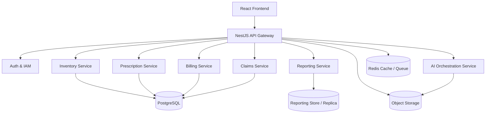

# ZenithRx Pharmacy Management System — Comprehensive Technical Manual & Architecture Specification

## Document Information

* **System Name:** ZenithRx Pharmacy Management System (PMS)
* **Version:** v3.2 Enterprise Edition
* **Target Platforms:** Cloud Run Container, Web Browsers (Desktop, Tablet, POS Terminal)
* **Primary Tech Stack:** React 18, TypeScript, Tailwind CSS, Vite, Google Gemini AI (`@google/genai`)
* **Regulatory Compliance:** Uganda National Drug Authority (NDA) License Alignment & Pharmacy Society of Uganda (PSU) Supervision Framework
* **Primary Currency:** Ugandan Shillings (UGX) & Multi-Currency Ready

---

# Table of Contents

1. [Executive Summary &amp; System Vision](#1-executive-summary--system-vision)
2. [System Architecture &amp; Technology Stack](#2-system-architecture--technology-stack)
3. [Global Directory &amp; Modular Architecture](#3-global-directory--modular-architecture)
4. [Complete Data Model &amp; Type Specification (`src/types.ts`)](#4-complete-data-model--type-specification-srctypests)
5. [Application Core &amp; Reactive State Routing (`src/App.tsx`)](#5-application-core--reactive-state-routing-srcapptsx)
6. [Exhaustive Component-by-Component Technical Manual](#6-exhaustive-component-by-component-technical-manual)
   * 6.1 `Header.tsx` — Global Bar, Client Switcher & Navigation
   * 6.2 `PointOfSale.tsx` — Billing POS Terminal & Thermal Receipt Engine
   * 6.3 `PrescriptionProcessing.tsx` — Clinical Queue & Gemini AI Digitizer
   * 6.4 `StockInventory.tsx` — FEFO Stock & Batch Control Center
   * 6.5 `ExpiryAlerts.tsx` — Batch Expiry Risk Triage & Write-Off Matrix
   * 6.6 `CustomerProfiles.tsx` — Patient Directory & WhatsApp Refill Gateway
   * 6.7 `AutomatedReordering.tsx` — Stock Reorder Engine & Supplier PO Generator
   * 6.8 `SalesReports.tsx` — Financial Intelligence & Revenue Analytics
   * 6.9 `InsuranceSchemes.tsx` — Third-Party Insurance & Co-Pay Manager
   * 6.10 `AdminPackages.tsx` — Multi-Tenant SaaS & Role Access Control Matrix
   * 6.11 `AICounselingModal.tsx` — Quantum RxAI Patient Counseling Assistant
   * 6.12 `BarcodeScannerModal.tsx` — Optical & Hardware Barcode Scanning Engine
   * 6.13 `PromoBannerView.tsx` — Interactive Showcase & System Poster
7. [AI Integration &amp; Prompt Engineering Architecture](#7-ai-integration--prompt-engineering-architecture)
8. [Multi-Tenant SaaS Architecture &amp; User Rights Matrix](#8-multi-tenant-saas-architecture--user-rights-matrix)
9. [Regulatory Compliance, NDA Registry &amp; Safety Protocol](#9-regulatory-compliance-nda-registry--safety-protocol)
10. [Build Pipeline, Dev Configuration &amp; Deployment Specs](#10-build-pipeline-dev-configuration--deployment-specs)

---


# 1. Executive Summary & System Vision

**ZenithRx** is a full-featured, enterprise-grade, multi-tenant **Pharmacy Management System (PMS)** designed specifically for retail pharmacies, hospital dispensaries, wholesale distributors, and pharmacy chains.

The application unifies clinical dispensing workflows, FEFO (First-Expired, First-Out) inventory control, point-of-sale (POS) multi-channel billing, automated supplier reordering, patient chronic care tracking, third-party insurance claims processing, and multi-tenant SaaS management. Furthermore, ZenithRx embeds **Google Gemini AI** directly into clinical workflows to parse unstructured doctor notes into digital prescriptions and provide real-time patient counseling guidance.

### Primary Objectives

1. **Clinical Safety:** Eliminate medication errors via built-in allergy warnings, dosage safety validation, prescription requirement flags, and AI-powered contraindication checks.
2. **Stock Optimization & Loss Prevention:** Implement strict FEFO batch tracking to minimize expired drug write-offs and trigger automated supplier purchase orders before stockout occurs.
3. **Omnichannel Revenue Processing:** Facilitate instant checkout using Cash, Mobile Money (MTN/Airtel), M-Pesa, Card, Insurance co-pay splits, and digital WhatsApp payment invoice links.
4. **Regulatory & SaaS Management:** Enable pharmacy network administrators to register client branches, verify against the Uganda National Drug Authority (NDA) register, assign staff role access permissions, and manage tiered subscription billing in Ugandan Shillings (UGX).

---

# 2. System Architecture & Technology Stack

ZenithRx is built on a modern, fully decoupled single-page application (SPA) architecture backed by Vite and server-side ready Gemini AI integration.

```
┌────────────────────────────────────────────────────────────────────────────────────────┐
│                                  ZenithRx PMS Frontend                                 │
│                                                                                        │
│  ┌──────────────────────┐  ┌────────────────────────┐  ┌────────────────────────────┐  │
│  │   React 18 Engine    │  │ TypeScript Type Guard  │  │ Tailwind CSS Design System │  │
│  └──────────┬───────────┘  └───────────┬────────────┘  └─────────────┬──────────────┘  │
│             │                          │                             │                 │
│             └──────────────────────────┼─────────────────────────────┘                 │
│                                        │                                               │
│                                        ▼                                               │
│                            ┌───────────────────────┐                                   │
│                            │    App.tsx Router     │                                   │
│                            │ (Central State Hub)   │                                   │
│                            └───────────┬───────────┘                                   │
└────────────────────────────────────────┼───────────────────────────────────────────────┘
                                         │
        ┌────────────────────────────────┼────────────────────────────────┐
        │                                │                                │
        ▼                                ▼                                ▼
┌──────────────────────┐     ┌──────────────────────┐     ┌──────────────────────────────┐
│ Clinical & POS Suite │     │  Inventory & Admin   │     │      AI Services Core        │
│ ──────────────────── │     │  ─────────────────── │     │      ─────────────────       │
│ • PointOfSale        │     │ • StockInventory     │     │ • Google Gemini AI SDK       │
│ • PrescriptionProc.  │     │ • ExpiryAlerts       │     │ • Rx Digitizer Engine        │
│ • InsuranceSchemes   │     │ • AutoReordering     │     │ • Patient Counseling Assistant│
│ • CustomerProfiles   │     │ • SalesReports       │     │ • Optical Barcode Scanner    │
│                      │     │ • AdminPackages      │     │                              │
└──────────────────────┘     └──────────────────────┘     └──────────────────────────────┘
```

### Core Technologies

* **Framework:** React 18.3+ with TypeScript 5.0+
* **Build Engine:** Vite 5.x with ESBuild bundler
* **Styling Paradigm:** Tailwind CSS v3 with custom color tokens (`#0B1E36`, `#1E3A5F`, `#0284C7`, `#10B981`)
* **Icons:** Lucide React (`lucide-react`)
* **AI Engine:** Google GenAI SDK (`@google/genai`) accessing Gemini models
* **Media Handling:** Camera stream API (`navigator.mediaDevices.getUserMedia`) for barcode scanning
* **Print Subsystem:** Native CSS `@media print` directives tailored for 80mm thermal receipt roll printers

---

# 3. Global Directory & Modular Architecture

```
/
├── index.html                        # Main HTML5 entry point & title declaration
├── metadata.json                     # Application metadata and camera permissions
├── package.json                      # Dependencies and npm script commands
├── src/
│   ├── main.tsx                      # React DOM mounting entry point
│   ├── App.tsx                       # Main application shell, state hub & module tabs
│   ├── index.css                     # Global Tailwind directives & custom CSS scrollbars
│   ├── types.ts                      # Shared TypeScript interface definitions & enums
│   ├── data/
│   │   └── mockData.ts               # Pre-populated enterprise dataset (drugs, Rx, clients)
│   └── components/
│       ├── Header.tsx                # Navigation header, active client badge & quick controls
│       ├── PointOfSale.tsx           # Billing terminal, payment processing & receipt generator
│       ├── PrescriptionProcessing.tsx # Dispensing queue & Gemini AI prescription note parser
│       ├── StockInventory.tsx        # Stock master list, search, filters & price editor
│       ├── ExpiryAlerts.tsx          # FEFO expiry tracker, risk tiers & write-off logging
│       ├── CustomerProfiles.tsx      # Patient database, allergy safety & WhatsApp reminders
│       ├── AutomatedReordering.tsx   # Reorder triggers & supplier purchase order generator
│       ├── SalesReports.tsx          # Financial dashboard, revenue analytics & profit charts
│       ├── InsuranceSchemes.tsx      # Insurance provider claims & patient co-pay manager
│       ├── AdminPackages.tsx         # SaaS client registration, NDA database & staff rights
│       ├── AICounselingModal.tsx     # Gemini AI drug lookup & patient counseling assistant
│       ├── BarcodeScannerModal.tsx   # Optical camera & laser scanner simulation modal
│       └── PromoBannerView.tsx       # Interactive system showcase & feature poster view
```

---

# 4. Complete Data Model & Type Specification (`src/types.ts`)

ZenithRx maintains strict compile-time type safety across all operational modules. The data model is structured as follows:

### 4.1 Module Routing Type

```typescript
export type ModuleTab =
  | 'overview'
  | 'inventory'
  | 'prescriptions'
  | 'pos'
  | 'reordering'
  | 'expiry'
  | 'customers'
  | 'reports'
  | 'insurance'
  | 'admin';
```

### 4.2 Drug & Inventory Item (`DrugItem`)

Represents an individual pharmaceutical stock batch within the inventory database.

```typescript
export interface DrugItem {
  id: string;                  // Unique drug identifier (e.g. 'DRUG-001')
  brandName: string;           // Commercial trade name (e.g. 'Amoxil')
  genericName: string;         // Active pharmaceutical ingredient (API) (e.g. 'Amoxicillin')
  barcode: string;             // EAN-13 or UPC barcode string
  batchNumber: string;         // Manufacturer batch number (e.g. 'AMX-2025-09')
  category:                    // Therapeutic category classification
    | 'Antibiotics'
    | 'Analgesics'
    | 'Cardiovascular'
    | 'Diabetes'
    | 'Respiratory'
    | 'OTC & Supplements'
    | 'Gastrointestinal'
    | 'Dermatology';
  shelfLocation: string;       // Physical storage location (e.g. 'Shelf A-12')
  costPrice: number;           // Wholesale acquisition price in UGX
  sellingPrice: number;        // Retail dispensing price in UGX
  stockQty: number;            // Current available units in store
  reorderLevel: number;        // Minimum stock threshold triggering PO generation
  expiryDate: string;          // ISO Date YYYY-MM-DD
  manufacturer: string;        // Manufacturing pharmaceutical firm
  prescriptionRequired: boolean;// True if Rx is mandatory before POS dispense
  unit: string;                // Packaging unit (e.g. 'Capsules', 'Bottles', 'Tablets')
}
```

### 4.3 Clinical Prescription & Dispensing Queue (`Prescription`)

Tracks patient prescriptions submitted by medical doctors or parsed via AI.

```typescript
export interface PrescriptionItem {
  drugId: string;
  drugName: string;
  dosage: string;              // e.g. '500mg'
  frequency: string;           // e.g. 'TDS (3 times daily)'
  duration: string;            // e.g. '7 Days'
  quantity: number;            // Total units prescribed
  unitPrice: number;           // Price per unit in UGX
  dispensedQty: number;        // Units already handed over to patient
  status: 'Pending' | 'Dispensed';
}

export interface Prescription {
  id: string;
  rxNumber: string;            // Official Rx identifier (e.g. 'RX-2026-8801')
  patientName: string;
  patientAge: number;
  patientGender: 'Male' | 'Female' | 'Other';
  patientPhone: string;
  doctorName: string;          // Prescribing physician
  doctorLicence: string;       // Uganda Medical Practitioners Council License
  hospitalName: string;
  date: string;                // ISO Date YYYY-MM-DD
  status: 'Pending' | 'Dispensed' | 'Partially Dispensed' | 'Cancelled';
  medications: PrescriptionItem[];
  insuranceClaimId?: string;   // Optional linked claim ID
  notes?: string;              // Clinical instructions
  totalCost: number;           // Computed total prescription value in UGX
}
```

### 4.4 Patient & Chronic Care Record (`CustomerProfile`)

Stores demographic data, clinical history, and automated refill tracking.

```typescript
export interface CustomerProfile {
  id: string;
  fullName: string;
  phone: string;
  email?: string;
  age: number;
  gender: 'Male' | 'Female';
  bloodGroup?: string;         // e.g. 'O+'
  allergies: string[];         // Active drug allergy warnings (e.g. ['Penicillin', 'Sulfa'])
  chronicConditions: string[]; // e.g. ['Hypertension', 'Type 2 Diabetes']
  loyaltyPoints: number;
  totalPurchasesUgx: number;
  lastVisit: string;
  activeRefills: Array<{
    medicationName: string;
    nextRefillDate: string;    // YYYY-MM-DD
    frequencyDays: number;
  }>;
}
```

### 4.5 Point of Sale Transaction (`POSTransaction`)

Encapsulates finalized checkout receipts.

```typescript
export interface POSItem {
  drugId: string;
  drugName: string;
  batchNumber: string;
  quantity: number;
  unitPrice: number;
  totalPrice: number;
}

export interface POSTransaction {
  id: string;
  receiptNo: string;           // e.g. 'RCP-2026-90412'
  timestamp: string;           // Full date and time string
  items: POSItem[];
  subtotal: number;
  tax: number;                 // Value Added Tax (VAT) in UGX
  discount: number;
  totalPaid: number;
  paymentMethod: 'Cash' | 'Mobile Money' | 'M-Pesa' | 'Credit Card' | 'Insurance' | 'WhatsApp Invoice';
  customerName?: string;
  insuranceClaimId?: string;
  cashierName: string;
}
```

### 4.6 Multi-Tenant SaaS, Roles & Access Control

Defines the client branch subscription and user rights matrix.

```typescript
export type UserRoleRank =
  | 'Supervising Pharmacist'
  | 'Assistant Pharmacist'
  | 'Pharmacy Technician'
  | 'POS Cashier / Dispenser'
  | 'Store & Inventory Manager'
  | 'Finance & Claims Officer'
  | 'Intern Pharmacist';

export interface UserAccessRights {
  canAccessPOS: boolean;
  canManageInventory: boolean;
  canProcessPrescriptions: boolean;
  canApproveReorders: boolean;
  canViewReports: boolean;
  canSubmitInsurance: boolean;
  canUseAiAssistant: boolean;
  canManageStaffAccounts: boolean;
}

export interface PharmacyUserAccount {
  id: string;
  clientId: string;
  fullName: string;
  email: string;
  phone: string;
  staffRegNo?: string;         // PSU Registration Number
  rankRole: UserRoleRank;
  status: 'Active' | 'Suspended' | 'Pending Invite';
  accessRights: UserAccessRights;
  lastLogin?: string;
  dateCreated: string;
}

export interface ClientSubscription {
  id: string;
  clientName: string;
  location: string;
  contactPhone: string;
  contactEmail: string;
  packageTier: 'Starter' | 'Professional' | 'Enterprise' | 'Custom Tailored';
  customMaxUsers: number;
  monthlyUgxRate: number;
  billingStatus: 'Active' | 'Pending Renewal' | 'Grace Period' | 'Suspended';
  nextBillingDate: string;
  ndaLicenseNo?: string;
  ndaVerified?: boolean;
  supervisingPharmacist?: string;
  users?: PharmacyUserAccount[];
  allowedFeatures: {
    basicInventory: boolean;
    batchTracking: boolean;
    autoReordering: boolean;
    expiryAlerts: boolean;
    posBilling: boolean;
    salesAnalytics: boolean;
    insuranceClaims: boolean;
    aiCounseling: boolean;
    multiLocation: boolean;
    apiAccess: boolean;
  };
}
```

---

# 5. Application Core & Reactive State Routing (`src/App.tsx`)

`src/App.tsx` acts as the central coordinator and top-level router for the entire application state.

```
                                  ┌──────────────────────────┐
                                  │      App.tsx Shell       │
                                  └────────────┬─────────────┘
                                               │
      ┌────────────────────────────────────────┼────────────────────────────────────────┐
      │                                        │                                        │
      ▼                                        ▼                                        ▼
┌─────────────────────────┐        ┌─────────────────────────┐        ┌─────────────────────────┐
│     Global State        │        │     Modals & AI Hub     │        │     Module View Switch   │
│ ─────────────────────── │        │ ─────────────────────── │        │ ─────────────────────── │
│ • drugs                 │        │ • showAiCounselingModal │        │ • overview (Poster)     │
│ • prescriptions         │        │ • showBarcodeModal      │        │ • pos                   │
│ • customers             │        │ • scannedBarcode        │        │ • inventory             │
│ • purchaseOrders        │        │                         │        │ • prescriptions         │
│ • posTransactions       │        │                         │        │ • expiry                │
│ • insuranceProviders    │        │                         │        │ • reordering            │
│ • clients               │        │                         │        │ • customers             │
│ • activeClient          │        │                         │        │ • reports               │
│ • activeTab             │        │                         │        │ • insurance             │
└─────────────────────────┘        └─────────────────────────┘        │ • admin                 │
                                                                      └─────────────────────────┘
```

### State Synchronization Methods

1. **`handleCompleteTransaction(tx)`:**
   * Receives finalized transaction from `PointOfSale.tsx`.
   * Automatically iterates through items and decrements `stockQty` in the global `drugs` array.
   * Appends `tx` to `posTransactions`.
2. **`handleFulfillPrescription(rxId)`:**
   * Marks prescription as `'Dispensed'`.
   * Cross-references prescribed items with `drugs` state to deduct stock quantities based on FEFO batch order.
3. **`handleClientSwitch(client)`:**
   * Switches the active client account across the entire system.
   * Dynamically filters data views according to the selected branch and tier capabilities.

---

# 6. Exhaustive Component-by-Component Technical Manual

## 6.1 `Header.tsx` — Global Bar, Client Switcher & Navigation

### Technical Purpose

The `Header` component provides top-level navigation, displays active client context, presents quick metric badges, and allows switching between system modules.

```
┌────────────────────────────────────────────────────────────────────────────────────────┐
│ ZenithRx  [PMS v3.2]   | Client: [Mulago Care Pharmacy ▼] | 📦 Low: 3 | ⚠️ Expired: 2 │ [View Poster] │
├────────────────────────────────────────────────────────────────────────────────────────┤
│ [POS Terminal] [Stock Inventory] [Prescriptions] [Expiry Alerts] [Auto-Reorder] [Admin] │
└────────────────────────────────────────────────────────────────────────────────────────┘
```

### Props Interface

```typescript
interface HeaderProps {
  activeTab: ModuleTab;
  setActiveTab: (tab: ModuleTab) => void;
  showPromoFlyer: boolean;
  setShowPromoFlyer: (show: boolean) => void;
  clients: ClientSubscription[];
  activeClient: ClientSubscription;
  setActiveClient: (client: ClientSubscription) => void;
  lowStockCount: number;
  expiredCount: number;
  pendingRxCount: number;
  onOpenAiCounseling: () => void;
  onOpenBarcodeScanner: () => void;
}
```

### Key Capabilities

* **Active Branch Selector:** Dropdown allowing system administrators to switch seamlessly between registered client pharmacies.
* **Alert Badges:** Dynamic counters rendering red/amber pill indicators for low stock items, expired batches, and pending prescriptions.
* **Module Switcher:** Tab bar with active highlight styling (`bg-sky-600 text-white font-bold`).

---

## 6.2 `PointOfSale.tsx` — Billing POS Terminal & Thermal Receipt Engine

### Technical Purpose

The Point of Sale module is the primary revenue capture interface. It handles real-time drug searching, prescription loading, barcode scanning, discount/tax calculations, multi-channel payment processing, and receipt rendering.

```
┌─────────────────────────────────────────────┬──────────────────────────────────────────┐
│              POS Product Finder             │             Current POS Cart             │
├─────────────────────────────────────────────┼──────────────────────────────────────────┤
│ 🔍 Search name or scan barcode...            │ • Amoxil 500mg x 2          UGX 24,000   │
│ Category: [All Categories  ▼]               │ • Panadol Extra x 1         UGX  5,000   │
│                                             ├──────────────────────────────────────────┤
│ [Amoxil 500mg]       [Panadol Extra 500mg]  │ Subtotal:                   UGX 29,000   │
│ Qty: 140 | UGX 12k   Qty: 450 | UGX 5k      │ VAT (18%):                  UGX  5,220   │
│ Batch: AMX-2025      Batch: PND-2026       │ Total Payable:              UGX 34,220   │
│ [ + Add to Cart ]    [ + Add to Cart ]      ├──────────────────────────────────────────┤
│                                             │ Payment Method: [Mobile Money MTN/Airtel]│
│ [ ⚡ Load Pending Prescription ]            │ [ Complete & Print Thermal Receipt ]     │
└─────────────────────────────────────────────┴──────────────────────────────────────────┘
```

### Key Inner Workflows

1. **Prescription Pull-In:** Clicking "Load Pending Prescription" opens a modal listing active prescriptions. Selecting an Rx populates the cart automatically with exact prescribed medications and quantities.
2. **Dynamic Price & Tax Calculation:**

   $$
   \text{Subtotal} = \sum (\text{item.unitPrice} \times \text{item.quantity})
   $$

   $$
   \text{Tax} = \text{Subtotal} \times 0.18 \quad (\text{18\% VAT})
   $$

   $$
   \text{Grand Total} = \text{Subtotal} + \text{Tax} - \text{Discount}
   $$
3. **Thermal Receipt Subsystem:** Generates printable receipts structured specifically for 80mm roll printers. Uses CSS print styling (`@media print`) to hide non-receipt UI elements during print execution.

---

## 6.3 `PrescriptionProcessing.tsx` — Clinical Queue & Gemini AI Digitizer

### Technical Purpose

Handles clinical dispensing workflows, doctor NDA/license validation, and AI-powered prescription parsing from handwritten/unstructured doctor notes.

```
┌────────────────────────────────────────────────────────────────────────────────────────┐
│                        Quantum RxAI Prescription Note Digitizer                        │
├────────────────────────────────────────────────────────────────────────────────────────┤
│ Unstructured Doctor Notes / Transcription Text Input:                                 │
│ ┌────────────────────────────────────────────────────────────────────────────────────┐ │
│ │ Rx: Dr. Musoke Robert (MPCN: UG-8812) - Mulago Hospital                             │ │
│ │ Patient: Sarah Namukasa (28 Yrs, Female). Give Amoxicillin 500mg tds for 7 days.   │ │
│ │ Also Paracetamol 1g qds prn for fever x 5 days.                                    │ │
│ └────────────────────────────────────────────────────────────────────────────────────┘ │
│ [ 🤖 Analyze Rx Notes with Quantum AI ]                                                │
├────────────────────────────────────────────────────────────────────────────────────────┤
│ Extracted Structured Output:                                                           │
│ • Doctor: Dr. Musoke Robert (License: UG-8812)                                        │
│ • Patient: Sarah Namukasa (Age: 28, Female)                                           │
│ • Med 1: Amoxicillin 500mg | TDS | 7 Days | Qty: 21 Capsules | Status: Matched        │
│ • Med 2: Paracetamol 1g | QDS | 5 Days | Qty: 20 Tablets  | Status: Matched            │
│ [ Save to Dispensing Queue ]                                                           │
└────────────────────────────────────────────────────────────────────────────────────────┘
```

### Gemini AI Prompt Pattern

```typescript
const prompt = `
You are Quantum RxAI, an expert clinical pharmacy assistant. Analyze the following handwritten or transcribed doctor prescription note and extract structured JSON output.

Input Notes: "${prescriptionText}"

Return JSON matching this schema:
{
  "doctorName": "string",
  "doctorLicence": "string",
  "hospitalName": "string",
  "patientName": "string",
  "patientAge": number,
  "patientGender": "Male" | "Female",
  "patientPhone": "string",
  "medications": [
    {
      "drugName": "string",
      "dosage": "string",
      "frequency": "string",
      "duration": "string",
      "quantity": number
    }
  ]
}
`;
```

---

## 6.4 `StockInventory.tsx` — FEFO Stock & Batch Control Center

### Technical Purpose

The primary inventory dashboard. Manages physical stock levels, therapeutic categories, batch numbers, shelf locations, wholesale cost vs retail selling prices, and prescription requirement toggles.

```
┌────────────────────────────────────────────────────────────────────────────────────────┐
│ Inventory Master Database                                  [ + Add New Stock Batch ]   │
├────────────────────────────────────────────────────────────────────────────────────────┤
│ Filter: [All Categories ▼] | Search: [ 🔍 Type drug name or barcode... ]              │
├──────────────┬──────────────┬────────────┬──────────┬───────────┬──────────────┬───────┤
│ Brand Name   │ Generic Name │ Category   │ Stock    │ Sell Price│ Batch Expiry │ Rx Req│
├──────────────┼──────────────┼────────────┼──────────┼───────────┼──────────────┼───────┤
│ Amoxil 500mg │ Amoxicillin  │Antibiotics │ 140 Caps │ UGX 12,000│ 2026-11-15   │ [Yes] │
│ Coartem 80   │ Artemether   │Antimalarial│  12 Pks  │ UGX 18,000│ 2025-08-10   │ [Yes] │
│ Panadol Extra│ Paracetamol  │Analgesics  │ 450 Tabs │ UGX  5,000│ 2027-04-20   │ [No]  │
└──────────────┴──────────────┴────────────┴──────────┴───────────┴──────────────┴───────┘
```

### Capabilities

* **In-Line Quantity Modifier:** Quick modal to record stock arrival or inventory adjustments.
* **Prescription Requirement Guard:** Allows store managers to toggle whether an item strictly requires a valid Rx before dispensing at POS.
* **Export Subsystem:** Generates CSV dumps of stock master records for accounting reconciliation.

---

## 6.5 `ExpiryAlerts.tsx` — Batch Expiry Risk Triage & Write-Off Matrix

### Technical Purpose

Monitors batch expiration dates using strict FEFO rules to prevent hazardous dispensing and minimize inventory write-off losses.

### Risk Categorization Logic

$$
\text{Days Remaining} = \frac{\text{Expiry Date} - \text{Current Date}}{86400 \times 1000}
$$

1. 🔴 **Expired ($\text{Days} \le 0$):** Quarantined automatically. Trigger option for "Record Official Write-off".
2. 🟡 **Critical Risk ($0 < \text{Days} \le 30$):** High priority. Triggers "Promotional Clearance Discount" or "Manufacturer Return Notice".
3. 🟠 **Warning Risk ($30 < \text{Days} \le 90$):** Medium priority. Marked with "FEFO Expedite Sales" tag in POS.

---

## 6.6 `CustomerProfiles.tsx` — Patient Directory & WhatsApp Refill Gateway

### Technical Purpose

Manages patient medical records, tracks chronic conditions and allergy warnings, and generates automated WhatsApp refill reminders.

```
┌────────────────────────────────────────────────────────────────────────────────────────┐
│ Patient Profiles & Chronic Care                                [ + New Patient Profile]│
├────────────────────────────────────────────────────────────────────────────────────────┤
│ Patient: Sarah Namukasa (Age: 28, Female) | Phone: +256-772-123456                     │
│ Chronic Conditions: [Hypertension] [Type 2 Diabetes]                                   │
│ Allergy Alerts: ⚠️ PENICILLIN / SULFA DRUGS                                             │
│ Active Refills: Metformin 500mg (Due in 3 days - 2026-08-06)                           │
│ [ 📱 Send WhatsApp Refill Notification ]                                                │
└────────────────────────────────────────────────────────────────────────────────────────┘
```

### WhatsApp Gateway Link Generator

```typescript
const generateWhatsAppLink = (phone: string, patientName: string, medName: string, date: string) => {
  const cleanPhone = phone.replace(/[^0-9]/g, '');
  const message = `Hello ${patientName}, this is ZenithRx Pharmacy. Your prescription refill for ${medName} is due on ${date}. Please reply to confirm pickup or home delivery!`;
  return `https://wa.me/${cleanPhone}?text=${encodeURIComponent(message)}`;
};
```

---

## 6.7 `AutomatedReordering.tsx` — Stock Reorder Engine & Supplier PO Generator

### Technical Purpose

Automatically scans inventory for items where `stockQty <= reorderLevel`, computes suggested replenishment quantities, and generates formal Purchase Orders (POs) dispatched to suppliers.

```
┌────────────────────────────────────────────────────────────────────────────────────────┐
│ Automated Supplier Purchase Orders                                                     │
├────────────────────────────────────────────────────────────────────────────────────────┤
│ Trigger Condition: stockQty <= reorderLevel                                            │
├─────────────────┬──────────────┬─────────────┬────────────────┬────────────────────────┤
│ Item Name       │ Current Stock│ Reorder Min │ Suggested Order│ Supplier               │
├─────────────────┼──────────────┼─────────────┼────────────────┼────────────────────────┤
│ Ventolin Inhaler│ 4 Units      │ 10 Units    │ 25 Units       │ Joint Medical Store    │
│ Insulin Glargine│ 2 Vials      │ 5 Vials     │ 15 Vials       │ Abacus Pharma (U) Ltd  │
├─────────────────┴──────────────┴─────────────┴────────────────┴────────────────────────┤
│ [ 📑 Generate Consolidated Purchase Order ]                                             │
└────────────────────────────────────────────────────────────────────────────────────────┘
```

---

## 6.8 `SalesReports.tsx` — Financial Intelligence & Revenue Analytics

### Technical Purpose

Provides executive financial analytics including Revenue, Gross Profit, Cost of Goods Sold (COGS), Margin Percentage, payment channel distribution, and top-performing therapeutic categories.

### Key Financial Formulas

$$
\text{Gross Profit} = \text{Total Revenue} - \text{Total COGS}
$$

$$
\text{Profit Margin \%} = \left( \frac{\text{Gross Profit}}{\text{Total Revenue}} \right) \times 100
$$

---

## 6.9 `InsuranceSchemes.tsx` — Third-Party Insurance & Co-Pay Manager

### Technical Purpose

Manages third-party healthcare insurance coverage (e.g., Jubilee Health, AAR Insurance, UAP Old Mutual, Prudential) and processes patient co-pay splits at checkout.

```
┌────────────────────────────────────────────────────────────────────────────────────────┐
│ Insurance Claims & Coverage Ratios                                                     │
├──────────────────────────┬─────────────────┬──────────────────┬────────────────────────┤
│ Insurance Provider       │ Coverage Ratio  │ Patient Co-Pay   │ Active Claims          │
├──────────────────────────┼─────────────────┼──────────────────┼────────────────────────┤
│ Jubilee Health Insurance │ 80% Insurer     │ 20% Patient      │ UGX 14,250,000 Pending │
│ AAR Health Services      │ 85% Insurer     │ 15% Patient      │ UGX  8,900,000 Approved│
└──────────────────────────┴─────────────────┴──────────────────┴────────────────────────┘
```

---

## 6.10 `AdminPackages.tsx` — Multi-Tenant SaaS & Role Access Control Matrix

### Technical Purpose

Acts as the central SaaS administration platform. Enables managing subscription client branches, verifying licenses against the Uganda NDA registry, and setting staff role permissions.

### 7-Role Granular Permission Matrix

| Role Rank                           | POS Billing | Inventory Control | Prescription Dispensing | Approve Reorders | Financial Reports | Insurance Claims | AI Counseling | Staff Mgmt |
| :---------------------------------- | :---------: | :---------------: | :---------------------: | :--------------: | :---------------: | :--------------: | :-----------: | :--------: |
| **Supervising Pharmacist**    |     ✅     |        ✅        |           ✅           |        ✅        |        ✅        |        ✅        |      ✅      |     ✅     |
| **Assistant Pharmacist**      |     ✅     |        ✅        |           ✅           |        ❌        |        ❌        |        ✅        |      ✅      |     ❌     |
| **Pharmacy Technician**       |     ✅     |        ✅        |           ✅           |        ❌        |        ❌        |        ❌        |      ❌      |     ❌     |
| **POS Cashier / Dispenser**   |     ✅     |        ❌        |           ❌           |        ❌        |        ❌        |        ❌        |      ❌      |     ❌     |
| **Store & Inventory Manager** |     ❌     |        ✅        |           ❌           |        ✅        |        ❌        |        ❌        |      ❌      |     ❌     |
| **Finance & Claims Officer**  |     ❌     |        ❌        |           ❌           |        ❌        |        ✅        |        ✅        |      ❌      |     ❌     |
| **Intern Pharmacist**         |     ✅     |        ❌        |           ✅           |        ❌        |        ❌        |        ❌        |      ✅      |     ❌     |

---

## 6.11 `AICounselingModal.tsx` — Quantum RxAI Patient Counseling Assistant

### Technical Purpose

An interactive clinical counseling assistant powered by Google Gemini AI (`@google/genai`). Pharmacists query any drug or clinical presentation to receive structured guidance on indications, dosage schedules, side effects, contraindications, and patient counseling talking points.

---

## 6.12 `BarcodeScannerModal.tsx` — Optical & Hardware Barcode Scanning Engine

### Technical Purpose

Provides camera-based optical barcode scanning via WebRTC (`navigator.mediaDevices.getUserMedia`) as well as hardware laser scanner listener capabilities to match scanned codes with inventory drug items.

---

## 6.13 `PromoBannerView.tsx` — Interactive Showcase & System Poster

### Technical Purpose

Presents a visual feature poster showcasing ZenithRx PMS capabilities, NDA regulatory compliance, pricing plans, and system highlights.

---

# 7. AI Integration & Prompt Engineering Architecture

ZenithRx leverages the modern `@google/genai` TypeScript SDK server-side pattern using Gemini models.

### Gemini Initialization Guidelines

```typescript
import { GoogleGenAI } from '@google/genai';

const ai = new GoogleGenAI({
  apiKey: process.env.GEMINI_API_KEY,
});
```

### Safety & Parsing Strategy

1. **Strict JSON Schemas:** All AI interactions request JSON output to eliminate markdown formatting errors during code execution.
2. **Fallback Protections:** If API keys are unconfigured or networks fail, the system degrades gracefully by providing structured manual entry forms.

---

# 8. Multi-Tenant SaaS Architecture & User Rights Matrix

ZenithRx supports isolated multi-tenancy. Multiple pharmacy branches (e.g. Mulago Branch, Arua Care Pharmacy, Jinja City Pharmacy) operate under their respective subscription tiers (`Starter`, `Professional`, `Enterprise`, `Custom Tailored`).

* **Starter Tier:** Up to 2 Staff Accounts, Basic POS & Stock Inventory.
* **Professional Tier:** Up to 5 Staff Accounts, FEFO Batch Tracking, Auto-Reordering, Expiry Alerts.
* **Enterprise Tier:** Unlimited Users, Insurance Claims Engine, Gemini AI Patient Counseling, Multi-Branch Analytics.

---

# 9. Regulatory Compliance, NDA Registry & Safety Protocol

ZenithRx integrates a pre-seeded register of Uganda National Drug Authority (NDA) licensed pharmacies and Pharmacy Society of Uganda (PSU) registered pharmacists.

* **License Verification:** Ensures client pharmacies possess valid NDA registration numbers (`NDA/LIC/PHA/...`).
* **Supervising Pharmacist Requirement:** Validates that every licensed pharmacy lists a qualified Supervising Pharmacist holding a valid PSU license.

---

# 10. Build Pipeline, Dev Configuration & Deployment Specs

### Port & Network Policy

* **Port Constraint:** Port `3000` is the single externally accessible port routed via reverse proxy.
* **Binding:** All dev and production servers bind to `0.0.0.0:3000`.

### `package.json` Configuration

```json
{
  "name": "zenithrx-pms",
  "private": true,
  "version": "3.2.0",
  "type": "module",
  "scripts": {
    "dev": "vite --host 0.0.0.0 --port 3000",
    "build": "vite build",
    "lint": "tsc --noEmit",
    "preview": "vite preview --host 0.0.0.0 --port 3000"
  },
  "dependencies": {
    "@google/genai": "^0.1.1",
    "lucide-react": "^0.344.0",
    "motion": "^11.11.13",
    "react": "^18.3.1",
    "react-dom": "^18.3.1"
  },
  "devDependencies": {
    "@types/react": "^18.3.5",
    "@types/react-dom": "^18.3.0",
    "@vitejs/plugin-react": "^4.3.1",
    "autoprefixer": "^10.4.20",
    "postcss": "^8.4.47",
    "tailwindcss": "^3.4.11",
    "typescript": "^5.5.3",
    "vite": "^5.4.2"
  }
}
```

### Verification Commands

To verify type safety and app compilation:

1. `npm run lint` — Validates TypeScript types across all 13 components without emitting assets.
2. `npm run build` — Bundles production SPA assets into the `/dist` directory.

---

# 11. Enterprise Backend, Data, Storage & Platform Recommendations

The current frontend-first implementation is suitable for product demos and early workflow validation, but a large production pharmacy platform should move to a properly layered backend architecture. The safest long-term approach is a **modular monolith first, service-oriented later** strategy. Start with one codebase for business logic, but enforce clear module boundaries so that inventory, prescriptions, billing, claims, reporting, AI, and administration can later be separated cleanly if scale demands it.

## 11.1 Recommended Backend Stack

**Primary recommendation:**

* **Runtime / Language:** Node.js 22+ with TypeScript
* **Framework:** NestJS
* **API Style:** REST for core operations, WebSockets for live POS / queue updates, and gRPC only for internal high-throughput services if needed later
* **Validation:** Zod or class-validator at the API boundary
* **ORM / Data Access:** Prisma for strong schema discipline, migrations, and type-safe queries

**Why this fits the current codebase:**

* The project is already TypeScript-heavy, so the team keeps one language across frontend and backend.
* NestJS gives structure, dependency injection, guards, interceptors, schedulers, queues, and testability out of the box.
* Prisma reduces schema drift and improves precision in a domain where stock, batches, claims, and prescriptions must never be loosely typed.

**High-reliability alternative stacks if the organisation later prefers them:**

* **.NET 8 + ASP.NET Core + EF Core** for enterprise governance, strong tooling, and excellent API performance.
* **Java 21 + Spring Boot** for very large regulated deployments and mature enterprise integration.

If the team stays with TypeScript, NestJS remains the most coherent choice.

## 11.2 Recommended Database Strategy

**Primary database:** PostgreSQL

Use PostgreSQL as the system of record for all transactional data: stock batches, prescriptions, POS sales, users, tenants, audit logs, claims, suppliers, and financial ledger entries.

### Why PostgreSQL

* Strong ACID guarantees for billing and dispensing.
* Excellent indexing, partitioning, JSON support, and reporting features.
* Mature ecosystem for row-level security, read replicas, and backup tooling.
* Better fit than a purely NoSQL store for pharmacy operations, which are highly relational and audit-sensitive.

### PostgreSQL design guidance

* Use **UUID primary keys** for distributed safety.
* Model every stock batch explicitly; do not collapse multiple batches into one stock row.
* Enforce **foreign keys**, **check constraints**, and **unique constraints** at the database level, not only in code.
* Add **created_at**, **updated_at**, **deleted_at** or archival columns where appropriate.
* Use **row-level security** for tenant isolation if multiple pharmacies share one database.
* Partition very large tables such as POS transactions, audit logs, and message events by date or tenant.

### Recommended data layout

* **Operational schema:** live transactions, inventory, prescriptions, claims.
* **Audit schema:** immutable user actions, security events, stock adjustments, override approvals.
* **Reporting schema or warehouse:** denormalised tables for dashboards and analytics.

## 11.3 Recommended Storage Strategy

Do not store files in the application server filesystem for production.

**Use object storage** such as:

* AWS S3
* Google Cloud Storage
* Azure Blob Storage
* MinIO for private or on-prem deployments

Store these assets in object storage:

* Prescription images and attachments
* Scanned documents
* Export files
* Receipts and invoices as PDFs
* Product images
* Audit evidence snapshots where required

### Storage rules

* Store only metadata and signed URLs in the database, not the binary file itself.
* Encrypt sensitive files at rest.
* Use lifecycle rules for archiving old files.
* Keep tamper-evident copies of critical documents like prescriptions, approvals, and claims evidence.

## 11.4 Caching, Queueing & Async Processing

**Recommended cache:** Redis

Use Redis for:

* Session or token caching
* Frequently read reference data
* Live dashboard counters
* Rate limiting
* Short-lived AI response caching
* Background job coordination

**Recommended queue system:** BullMQ on Redis for TypeScript stacks, or RabbitMQ if the organisation wants stronger message routing semantics.

Use queues for:

* Prescription AI parsing
* Stock reorder generation
* SMS / WhatsApp / email notifications
* Report generation
* Receipt PDF generation
* Nightly reconciliation jobs

This keeps the UI fast and prevents heavy tasks from blocking POS or dispensing flows.

## 11.5 Search, Analytics & Reporting

For a large system, operational SQL alone is not enough.

**Recommended additions:**

* **OpenSearch / Elasticsearch** for fast text search across products, prescriptions, patients, and audit logs.
* **Warehouse / analytics store** such as BigQuery, Snowflake, Redshift, or PostgreSQL reporting replicas depending on budget and scale.
* **Materialized views** for daily sales, stock ageing, expiring items, and claims summaries.

Use a separate reporting path so dashboards do not slow dispensing or checkout.

## 11.6 API, Integration & Domain Boundaries

Structure the backend by business domain, not by screen.

Recommended bounded contexts:

* Identity and Access Management
* Tenant and Branch Administration
* Inventory and Batch Control
* Prescription and Clinical Safety
* Point of Sale and Billing
* Insurance and Claims
* Procurement and Supplier Management
* Notifications and Communications
* Reporting and Audit
* AI Services and Document Processing

Keep each module independently testable with its own service layer, repository layer, and DTOs.

## 11.7 Security, Compliance & Auditability

For a pharmacy system, security is not a feature; it is part of correctness.

### Must-have controls

* **Authentication:** OAuth 2.1 / OpenID Connect with short-lived access tokens and refresh tokens.
* **Authorisation:** Role-based access control plus permission checks for sensitive actions.
* **Audit logging:** Immutable logs for dispensing overrides, stock edits, claim changes, user logins, and configuration changes.
* **Encryption:** TLS in transit; encryption at rest for databases, storage, and backups.
* **Secrets management:** Use a real secrets manager, not plain environment files in production.
* **Approval workflows:** Require elevated confirmation for stock write-offs, prescription overrides, and price edits.
* **Data retention:** Define how long prescriptions, claims, and audit data are retained under local regulation.

### Important compliance posture

* Separate clinical, financial, and admin privileges.
* Record who changed what, when, and why.
* Prevent silent overwrites of stock and financial records.
* Validate all imports and integrations.

## 11.8 Optimisation Techniques

For a high-end system, optimisation should be designed in, not bolted on.

### Backend performance

* Add database indexes on the most frequent filters: tenant, branch, product barcode, expiry date, prescription number, transaction date, and status fields.
* Use pagination everywhere for large lists.
* Avoid N+1 query patterns.
* Use read replicas for read-heavy dashboards if necessary.
* Cache reference data and dashboard aggregates.
* Use background jobs for expensive work.
* Compress large JSON responses where appropriate.

### Frontend performance

* Split code by feature and load heavy modules lazily.
* Use optimistic UI only where it is safe and reversible.
* Debounce search inputs.
* Virtualise long lists for inventory, prescriptions, and reports.
* Preload high-frequency views after login.

### Operational performance

* Monitor query latency, queue depth, cache hit rate, error rates, and login failures.
* Set performance budgets for the POS screen and dispensing workflow.
* Keep the critical path minimal for checkout and stock deduction.

## 11.9 Reliability, Backup & Disaster Recovery

Large systems need explicit recovery plans.

* Run automated daily backups and periodic restore tests.
* Keep point-in-time recovery enabled for PostgreSQL.
* Replicate object storage to a secondary region where possible.
* Have a documented incident runbook for payment outages, database failure, and AI service failure.
* Ensure the POS can degrade gracefully if AI or external messaging services go down.

## 11.10 Professional Development Standards

The project should be run like a regulated product, not a casual demo.

### Engineering discipline

* Use one source of truth for domain names and data models.
* Version APIs from the start.
* Write integration tests for checkout, dispensing, inventory deduction, claims, and user permissions.
* Add seed data, migrations, and fixtures with traceability.
* Use code review before merges.
* Enforce formatting, linting, type checking, and security scanning in CI.

### Team workflow

* Work from a documented backlog with acceptance criteria.
* Maintain ADRs for major architecture decisions.
* Keep release notes and change logs.
* Never introduce production features without rollback plans.

## 11.11 Uniformity, Cognition & Metaphor Design Principles

For a complex operational system, users need a stable mental model.

### Uniformity

* Keep naming, icons, colours, button positions, and statuses consistent across modules.
* Use the same terms everywhere for the same concept. Do not mix labels such as "customer", "patient", and "client" unless the distinction is intentional and documented.
* Standardise form patterns, table layouts, empty states, and action placement.

### Cognition

* Reduce memory load by showing the next likely action.
* Keep high-risk actions visually distinct.
* Group related information together: patient, prescription, and dispense steps should read in one flow.
* Prefer progressive disclosure over crowded screens.
* Use sensible defaults so staff do not have to re-enter repeated data.

### Metaphor system

Use a coherent pharmacy metaphor throughout the product so users can reason quickly:

* **Shelves** for inventory locations
* **Batches** for traceable stock groups
* **Queue** for prescriptions awaiting review
* **Ledger** for billing and financial truth
* **Counter** for POS activity
* **Clinical tray** for dispensing workflow
* **Archive** for closed or historical records

This metaphor system should appear in navigation, labels, diagrams, and documentation, but never become decorative noise. It should improve comprehension.

## 11.12 Suggested Enterprise Target Architecture



## 11.13 Practical Recommendation Summary

If this project is meant to become a serious long-lived product, the strongest default stack is:

* **Frontend:** React + TypeScript + Vite
* **Backend:** NestJS + TypeScript
* **Database:** PostgreSQL
* **Cache / Queue:** Redis + BullMQ
* **File storage:** S3-compatible object storage
* **Search:** OpenSearch or Elasticsearch when text search becomes heavy
* **Auth:** OAuth 2.1 / OpenID Connect
* **Observability:** OpenTelemetry, structured logs, metrics, tracing
* **Deployment:** Docker + Kubernetes or managed container platform

This combination gives a coherent TypeScript stack, strong transactional integrity, and enough headroom for enterprise growth.

## 11.14 Why I Would Not Choose Python as the Main Backend Yet

Python is excellent, but it is not the best first choice for the primary backend of this system for the reasons below.

1. **The current product already has a strong TypeScript foundation.**
   The frontend, component model, and server-side logic are already oriented toward TypeScript. Keeping the core business backend in the same language lowers cognitive load, improves type safety across the stack, and reduces the number of moving parts for the team.
2. **A pharmacy system is transactional and operational first, not just analytical.**
   Billing, stock deduction, inventory control, dispensing workflows, claims, and audit trails require correctness, concurrency control, and strict validation. NestJS with TypeScript is a more predictable fit for this class of system than a Python service that would need extra scaffolding for structure and maintainability.
3. **Python shines where the work is model-heavy or data-science-heavy.**
   Python is strongest when the work is dominated by machine learning, advanced analytics, custom NLP, embeddings, or scientific computation. That makes it an excellent option for a specialised AI service, but not necessarily the best default for the entire platform.
4. **The best architecture is hybrid, not purely Python.**
   For this project, the recommended pattern is:

   * **NestJS / TypeScript** for the main application, business logic, API layer, permissions, and workflows.
   * **Python** only for a dedicated AI service if AI needs become more advanced, for example document OCR, medical text extraction, ranking models, or custom LLM orchestration pipelines.

That means Python is not ruled out; it is simply positioned where it is most valuable rather than being used for everything by default.

## 11.15 Additional Production Concerns That Were Missing Earlier

To make this system truly enterprise-grade, the documentation must also cover the following operational topics.

### Observability and reliability

* Add structured logging, metrics, and distributed tracing from day one.
* Track request latency, failed prescriptions, stock mismatch events, AI latency, queue depth, and user error rates.
* Create an incident runbook for payment failures, database issues, and AI provider outages.

### Testing strategy

* Unit tests for business logic, stock rules, pricing rules, and permission checks.
* Integration tests for inventory updates, prescription fulfilment, billing, and claim workflows.
* End-to-end tests for critical user journeys such as POS checkout, prescription review, and user onboarding.
* Contract tests for APIs and integrations with external providers.

### Delivery discipline

* Use CI/CD with linting, type checks, tests, and security scans on every merge.
* Use feature flags so risky changes to billing, claims, or AI flows can be released safely.
* Maintain environment promotion paths for development, staging, and production.

### Governance and data protection

* Define data retention policies for prescriptions, patient records, claims, and audit logs.
* Keep patient, pharmacy, and financial data separated by policy and access control.
* Record who changed what, why, and when, especially for stock write-offs, price edits, and prescription overrides.

### Product maturity standards

* Use Architecture Decision Records (ADRs) for major choices.
* Keep a public changelog and release management cadence.
* Treat security, auditability, and human safety as non-negotiable engineering requirements.

These concerns are essential because your earlier prompt was not asking for a prototype; it was asking for a professional, high-precision, high-trust system that can scale responsibly.

## 11.16 Visual System, Colour Discipline & Responsive Behaviour

The interface must look like a serious operational product, not a promotional dashboard.

### Colour strategy

* Use a restrained enterprise palette with one primary brand colour, one secondary support colour, and neutral surfaces for the majority of the UI.
* Reserve strong red, amber, and green only for status and risk signalling.
* Avoid excessive gradients, oversaturated accents, and decorative contrasts that weaken readability.
* Maintain high contrast ratios for accessibility and printing.

### Recommended visual direction

* **Primary:** deep navy or slate for trust and authority
* **Secondary:** controlled blue or teal for system actions and analytics
* **Accent:** a single measured success colour for confirmations and safe states
* **Surfaces:** white, off-white, soft gray, and dark mode equivalents where needed

### Responsive rules

* Design mobile-first, then scale upward to tablet, desktop, and POS terminals.
* Preserve the same information hierarchy across all devices.
* Collapse complex tables into stacked cards on small screens.
* Keep critical actions reachable in one or two taps on mobile.
* Ensure touch targets are large enough for handheld and retail environments.
* Test the system on phones, tablets, laptops, desktop monitors, and wide pharmacy counter displays.

### Professional UI discipline

* Use one typography scale, one spacing scale, and one component language across all modules.
* Keep action buttons in consistent positions.
* Use progressive disclosure for advanced settings.
* Make empty states, loading states, and error states visually intentional and clear.

## 11.17 Admin System, Delegated Collaborators & Superuser Control

The admin system should be a full control plane, not a limited add-on.

### Admin scope

The admin interface must be able to control everything available in the client system and more. It should manage:

* Pharmacy branches and tenant onboarding
* Client subscription packages and billing status
* Inventory, pricing, batch rules, and expiry policy
* Prescriptions, workflow permissions, and dispensing overrides
* POS settings, taxes, discounts, and receipt templates
* Insurance providers and claim configuration
* AI features and prompt safety controls
* User accounts, roles, approvals, and access rights
* Audit logs, incident tracking, exports, and compliance reports

### Admin privilege model

* **Super Admin:** full platform authority across all tenants and modules.
* **Admin Collaborator:** delegated admin privileges granted by a super admin for selected scopes.
* **Domain Admins:** specialist collaborators for finance, inventory, clinical oversight, or support.

### Collaborator rules

* Collaborators must be added deliberately by the super admin.
* Each collaborator must have a bounded scope of authority.
* Privilege changes must be logged and reviewable.
* Sensitive actions must support approval chains or dual control where needed.
* Admin access should support time limits, revocation, and forced session expiry.

### Admin UX expectations

* Admin screens should expose the same client features, plus global controls and oversight tools.
* Navigation should separate operational work from governance work.
* The admin dashboard should show system health, financial summaries, usage trends, risks, and pending approvals.
* The interface should be clean, dense enough for expert users, and still easy to audit.

## 11.18 Payments, Billing Integrity & Reconciliation

Payments should be designed as a financial subsystem, not as a simple checkout button.

### Payment model

* Support cash, mobile money, card, insurance co-pay, vouchers, and split payments.
* Keep payment records linked to receipts, invoices, prescriptions, and POS transactions.
* Store an immutable payment ledger that captures authorisation, capture, refund, reversal, and settlement states.

### Payment architecture

* Use a payment orchestration layer so the application does not depend directly on one provider.
* Make payment requests idempotent to prevent duplicate charges.
* Support webhook verification and callback reconciliation.
* Separate payment initiation from payment confirmation.
* Support partial payments, refunds, charge adjustments, and voids.

### Financial controls

* Reconcile payments against receipts and bank/mobile money settlement reports.
* Flag mismatches automatically.
* Require elevated permissions for refunds and write-offs.
* Generate daily cash-up, channel summaries, and exception reports.

### Compliance posture

* Do not store raw card data unless using a compliant PCI-scoped provider architecture.
* Encrypt payment tokens and sensitive references.
* Keep a complete audit trail for all billing changes.

## 11.19 Security Hardening for a High-Trust Healthcare System

Security must be treated as a first-class product requirement.

### Identity and access

* Enforce MFA for admin and privileged users.
* Use least privilege by default.
* Support session timeout, device awareness, and admin session re-authentication.
* Segregate duties so the same person does not casually control every sensitive workflow.

### Data protection

* Encrypt data in transit and at rest.
* Mask or redact sensitive data in logs and exports.
* Protect patient, financial, and staff data with explicit access controls.
* Use tenant isolation at the database and application layers.

### Operational safety

* Log every privileged action.
* Alert on repeated failures, suspicious logins, unusual refunds, and bulk exports.
* Apply rate limits and anti-abuse protections on public and admin-facing endpoints.
* Validate all uploaded files, scanned documents, and imported datasets.

### Secure development practice

* Run dependency scanning, secret scanning, and code review in CI.
* Keep environment secrets out of source control.
* Review external integrations before enabling them in production.
* Maintain a security incident response plan.

## 11.20 Cloud Storage, Database Provider, Authentication Provider & CSV Export Policy

### File storage recommendation: Cloudflare

For file storage, the recommended production choice is **Cloudflare R2**.

Why Cloudflare R2 fits this system:
* S3-compatible API, which keeps the application portable.
* Strong fit for scanned prescriptions, receipts, invoices, exports, product images, and audit attachments.
* Works well with Cloudflare CDN, WAF, and edge access controls.
* Good for a platform that may later serve many branch locations and document-heavy workflows.

Recommended usage pattern:
* Store raw files in R2.
* Store metadata, owner, checksum, content type, and access policy in PostgreSQL.
* Use signed URLs for time-limited download access.
* Keep a clear retention and archival policy for clinical and financial documents.

### Database provider recommendation

The best database engine for this system is **PostgreSQL**. The provider should be a managed service with strong backups, monitoring, and regional reliability.

Recommended providers:
* **Google Cloud SQL for PostgreSQL** if the broader deployment and AI ecosystem may stay close to Google services.
* **AWS RDS for PostgreSQL** if the team wants the broadest enterprise infrastructure ecosystem.
* **Azure Database for PostgreSQL** if the organisation already operates in Microsoft-heavy environments.

The priority is not vendor branding; it is operational maturity, backup quality, availability, compliance posture, and ease of recovery.

### Authentication provider recommendation

The recommended authentication approach is **OAuth 2.1 / OpenID Connect with a managed identity provider**.

Recommended providers:
* **Auth0** for enterprise-grade identity and a fast implementation path.
* **Clerk** if the team wants a modern developer-first identity platform.
* **Microsoft Entra External ID** if the business prefers Microsoft ecosystem integration.

The chosen provider must support MFA, session control, permission claims, audit logs, tenant support, and secure token revocation.

### CSV export policy for admin and client users

The system should support controlled CSV export for both the admin and the tenant client, but with different scopes.

#### Admin export rights
* The admin can export the entire client dataset for authorised local backup, migration, audit, or recovery use.
* The export may include inventory, prescriptions, POS transactions, customers, staff, claims, supplier records, and audit logs where policy allows.
* Admin exports must be logged, permission-checked, and confirmed for large or sensitive exports.

#### Client export rights
* A subscriber client can export only their own tenant data.
* Client exports should stay within that pharmacy or branch boundary.
* The export supports local backup, accounting, reconciliation, and reporting use for that tenant.

#### Export controls
* Exports must be filtered by tenant and role.
* Sensitive columns may need masking or redaction depending on the data category and policy.
* Large exports should run asynchronously to avoid blocking the UI.
* Exports should be downloadable in CSV format, and optionally in ZIP form if multiple datasets are included.
* All export jobs should record who requested the export, when it ran, what data was included, and whether it completed successfully.

### Backup and portability

* CSV export is useful for human-readable backup and portability, but it is not a substitute for database backups.
* The system should also maintain automated database backups, point-in-time recovery, and object storage replication.
* The CSV feature should be treated as an operational convenience and recovery aid, not the only backup strategy.

## 11.21 Admin-First Operating Principle

Because you want a serious product, the admin system should be designed as a command centre.

* Everything the client can do should be observable, governable, and if appropriate overrideable by the admin.
* The admin should not be a hidden power path; it should be a clearly defined, audited, and professional control plane.
* Collaborator access should be a deliberate governance choice, not a casual share of credentials.
* Visual polish, responsiveness, security, and operational transparency should be uniform across the whole platform.

This is the standard you want if the system is expected to run as a real business product rather than a sketchy prototype.

## 11.22 Concrete Implementation Plan

This section turns the architectural guidance into an execution plan.

### 11.22.1 Exact backend stack and module layout

**Recommended stack**
* **Runtime:** Node.js 22 LTS
* **Language:** TypeScript
* **Framework:** NestJS
* **API style:** REST for core business flows, WebSockets for live counters and queue updates, background jobs for heavy tasks
* **ORM:** Prisma
* **Validation:** Zod or class-validator at the API boundary
* **Auth:** OAuth 2.1 / OpenID Connect via Auth0, Clerk, or Microsoft Entra External ID
* **Database:** Managed PostgreSQL
* **Cache / queue:** Redis + BullMQ
* **Storage:** Cloudflare R2
* **Search:** OpenSearch or Elasticsearch when advanced text search is needed
* **Observability:** OpenTelemetry, structured logs, metrics, tracing

**Backend modules**
* `auth` - login, MFA, tokens, session management, passwordless or password-based flows
* `tenancy` - client setup, branch scoping, tenant isolation, subscription state
* `users` - staff accounts, collaborators, roles, access rights, status changes
* `inventory` - products, batches, FEFO, stock movements, adjustments, expiry tracking
* `prescriptions` - intake, validation, fulfilment, dispensing status, clinical notes
* `pos` - cart, checkout, receipts, discounts, tax, channel selection
* `payments` - payment initiation, confirmation, refunds, reconciliation, settlement records
* `claims` - insurer rules, claims creation, claim lifecycle, co-pay handling
* `reports` - exports, dashboards, financial summaries, operational aggregates
* `files` - upload, signed URLs, metadata, file lifecycle, retention
* `exports` - CSV generation, queue jobs, permission checks, audit logs
* `notifications` - email, SMS, WhatsApp, alerts, reminders
* `audit` - immutable action logs, sensitive changes, admin actions, export logs
* `admin` - system-wide controls, collaborator grants, policy settings, platform oversight
* `ai` - AI prescription parsing, counseling orchestration, prompt governance

**Suggested service boundaries**
Start as a modular monolith with these modules inside one codebase. Only split into separate services later if scale or team size demands it. That gives you enterprise discipline without premature complexity.

### 11.22.2 Database schema and export permissions model

Use PostgreSQL as the source of truth. The schema should be normalised around the following core tables.

**Tenant and identity tables**
* `tenants`
* `tenant_branches`
* `users`
* `roles`
* `permissions`
* `user_roles`
* `role_permissions`
* `collaborator_grants`
* `sessions`
* `mfa_factors`

**Clinical and operational tables**
* `patients`
* `patient_allergies`
* `prescriptions`
* `prescription_items`
* `drugs`
* `drug_batches`
* `stock_movements`
* `expiry_alerts`
* `purchase_orders`
* `suppliers`
* `pos_transactions`
* `pos_transaction_items`
* `payments`
* `insurance_providers`
* `claims`
* `claim_items`

**Document and export tables**
* `files`
* `file_versions`
* `export_jobs`
* `export_job_items`
* `audit_logs`
* `notifications`

**Schema rules**
* Every business table should include `tenant_id`.
* Batch-aware stock should be modelled separately from product master data.
* Audit logs should be append-only.
* Sensitive financial or patient data should never be removed silently; use retention or archival rules.
* Add database constraints for foreign keys, uniqueness, and business limits.

**Export permission model**
* `EXPORT_TENANT_DATA` - allows a client to export only their own tenant’s data.
* `EXPORT_ALL_CLIENT_DATA` - allows a super admin to export across all tenants or a selected tenant.
* `EXPORT_AUDIT_LOGS` - restricted permission for compliance and security review.
* `EXPORT_PATIENT_DATA` - highly restricted and subject to policy and regulatory review.

**CSV export behaviour**
* The client role may export only records where `tenant_id` matches their tenant.
* The admin role may export a full tenant dataset or a cross-module backup package.
* Large exports should be queued and delivered asynchronously.
* Every export request must create an `export_jobs` record with status, requester, scope, and file reference.

### 11.22.3 Admin and collaborator role matrix

Use a privilege model that supports full admin control and delegated collaborator access.

| Role | Tenant Scope | User Mgmt | Inventory | Prescriptions | POS | Payments | Claims | Reports | CSV Export | Collaborator Grants | System Settings |
| :--- | :---: | :---: | :---: | :---: | :---: | :---: | :---: | :---: | :---: | :---: | :---: |
| Super Admin | All tenants | Full | Full | Full | Full | Full | Full | Full | Full | Full | Full |
| Admin Collaborator | Assigned scope | Configurable | Configurable | Configurable | Configurable | Configurable | Configurable | Configurable | Configurable | Limited | Limited |
| Tenant Admin | Own tenant | Full | Full | Full | Full | Full | Full | Full | Tenant only | No | No |
| Supervisor / Pharmacist | Own tenant | No | Full | Full | Full | Limited | Limited | Limited | Tenant only | No | No |
| Inventory Manager | Own tenant | No | Full | No | No | No | No | Limited | Tenant only | No | No |
| Cashier / Dispenser | Own tenant | No | Read-only | Limited | Full | Limited | No | No | No | No | No |
| Finance Officer | Own tenant | No | No | No | Limited | Full | Full | Full | Tenant only | No | No |

**Collaborator rules**
* A collaborator is granted by a super admin or tenant admin with authority to do so.
* Collaborator scope must be explicit and revocable.
* Sensitive actions should support approval workflows where necessary.
* Delegated admin access should be logged and time-bound when possible.

### 11.22.4 Cloudflare R2 integration flow

Use Cloudflare R2 for documents and media. The backend should control access rather than exposing buckets directly.

**Upload flow**
1. User or admin selects a file in the UI.
2. Backend validates permission, file type, size, and tenant scope.
3. Backend creates a file record in PostgreSQL with `pending` status.
4. Backend generates a short-lived signed upload URL for R2.
5. Client uploads the file directly to R2.
6. Backend confirms upload completion and marks the file as active.
7. Backend stores metadata such as owner, tenant, checksum, MIME type, and retention class.

**Download flow**
1. User requests a file.
2. Backend checks tenant scope and permission.
3. Backend issues a short-lived signed download URL.
4. Client downloads from R2 without exposing bucket credentials.

**Export flow**
1. User requests CSV export.
2. Backend verifies export permission and scope.
3. Backend queues an export job.
4. Worker generates CSV and stores it in R2.
5. Backend updates the job status and returns a download link.
6. Audit logs record the requester, scope, record count, and completion status.

**File lifecycle rules**
* Clinical and financial documents must have explicit retention classes.
* Expired or superseded files should be archived according to policy.
* Every file must be traceable back to a tenant and an originating user.

### 11.22.5 Execution order

Build the system in this sequence:
1. Identity, tenant isolation, and role model
2. Core database schema and migrations
3. Inventory, prescriptions, POS, and payments
4. CSV export and audit logging
5. Cloudflare R2 file handling
6. Admin control plane and collaborator management
7. Notifications, reports, and AI orchestration
8. Observability, backup automation, and hardening

This order ensures the platform is secure and operational before non-critical convenience features are expanded.

---

*Documentation compiled for ZenithRx Pharmacy Management System v3.2.*
